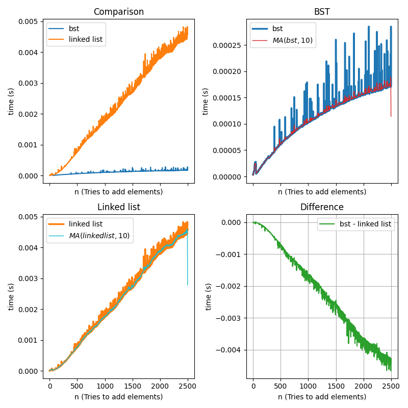
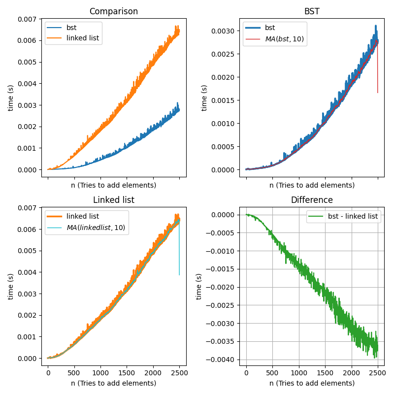
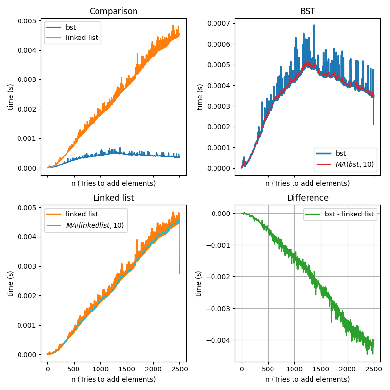

	<h1 style="text-align: center;">Mandatory assignment</h1>
	
Christian Salomonsen

	
February 17, 2023

## Introduction

In this task we are tasked with creating two implementations of a set. A set is
a datatype that contain an ordered sequence of unique elements. The two
implementations stem from what datatype is used 'under the hood' of the set,
that is, the *api* used in the internals of the set. One must be based on a
linked list implementation, and the other is up to the assignee. This report 
will explore using a *Binary search tree* (BST) as the other implementation.
When the set implementation is working, the remainder of the task is to generate
a spam filter using the set, and the operations *union*, *difference* and
*intersection* with some prior knowledge in the form of already classified spam
and non-spam mails.

The remaining part of the assignment is the evaluation. Comparing the two
implementations will be an essential part of this. Specifically investigating 
the differences in exectution time on operations from both implementations of 
the set.

## Technical background

Most of the code in this assignment is written in the programming language C.
With the exception of a script for data analysis written in another programming
language Python. A GNU Bash script is also provided for quickly comparing the
outputs of both the spamfilter built from `spamfilter.c`, and a test file 
`numbers.c` which does set operations on integers.

The pre-code provided for the assignment provides multiple C-source files for 
verifying that the output of the set implementation is correct. We use Make to
build the source code into executables.

The focus of the assignment will be on implementing an abstract data type (ADT)
for a set. An ADT is a programming paradigm where the user does not have to
interact with the interals of the program. Therefore the user does not
necessarily need to know how an implementation stores its data. 

### The set criteria

A set as mentioned in the introduction is a datatype, which contain unique 
ordered comparable elements. The set datatype is well suited with mathematical
operations like union, intersection and difference, which each on their own
produce a new set, which will be either a subset between mulitple sets or the
empty set, $\empty$. 

Given two sets $A$ and $B$, the operations mentioned can be further described as:
1. Union: $A\,\cup\,B =C$ -- New set of all elements from $A$ and $B$.
2. Intersection: $A\,\cap\,B =C$ -- New set of only the elements that are both
in $A$ and $B$
3. Difference: $A-B=C$ -- New set of elements in $A$, which are not in $B$

Additionally we also need ways of adding elements to the sets, checking if an
element is contained in a set, creation and destruction, etc. but these
implementations are spcific to the underlying datatype, which handles storage of
elements and will be discussed in the next sections.

## Design and implementation

The following section will be divided into two parts, one focusing on the set
implementation using the api provided by the linked list source code, and the
other creating a new implementation for a set, which instead uses a binary 
search tree to store elements.

### Set based on a linked list

The linked list in this implementation is provided in the assignments pre-code
and is a *doubly linked list*. This means that we have a dynamically stored list
where every node has a pointer to its next and previous node. This results in 
being able to traverse all the elements in either directions.

Due to the list not having any criterias for how the elements are to be arranged
internally, using a linked list as the backend of the set, means the list will
need methods for ordering.

The creation and destruction of the set is trivial and will create a list and
destroy the list respectively in addition of creating and destroying itself. 
This linked list will store the elements that are added to the set.

#### Adding a new element

Adding an element to the set is done in two steps:

1. Check if element already exist in list.
2. Add element to either the start or end of the list.

It should be noted that it could also be an idea to order the list by sorting
it every time a new element is inserted. However as we will see, this is not
always necessary.

Note that step 1. of the above example algorithm calls for traversing the whole
list, comparing the new element with the already existing ones.

#### Iterating over the set

Iterating over the set based on the linked list is done by:

1. Start at head of list, by setting this as the current element.
2. Check if the next pointer returns a element or not.
3. Retrieve the element of the next pointer if it exists.
4. Repeat step 2 $\rightarrow$ 3 until next does not exist.

Note that because the linked list is not ordered at this point, and the
implementation not necessarily sorts the list after each element is added, we
may sort the list on the creation of a set iterator.

Only sorting when a iterator is created saves a lot of computations, and will
for this specific assignment be valid as the only times the set needs to be
ordered the iterator is generated first. This however does not need to be the
case, and a choice should be made if the application of the source code is
different.

### Set based on a binary search tree

The binary search tree is a datatype, which stores elements in a tree-like
structure different from the sequential one we see in the linked list. The
general idea is to arrange entries to the tree based on comparing with the 
existing entries of the tree. Elements less than the initial one is moved to its
left and larger to its right. This means that looking up a element and inserting
a new element in general needs fewer operations than with a sequential structure
like a linked list.

It should however be noted that the implementation provided in this assignment
does not implement a balanced binary search tree, like and *AVL tree*, which use
rotations to constraint the difference in node depths. This implies that the
structure is very sensitive to the inital input to the tree. For example if the
inserted elements are ordered we would end up with principally a linked list.

The tree starts out with a root node, each node in the tree implemented in this
assignment stores a pointer to its two children located either to the right or
left of itself, and additionally a pointer to the parent of the node.

#### Adding a new element

Traversing a binary search tree is done by starting at the top, root node,
moving either to its left or right node. Therefore adding an element to the tree
can be done in these steps:

1. Set root node as the current evaluated node.
2. Compare new element with root node. Conditions:
	- Equality -- Elements are equal, do nothing.
	- Less than node -- move to nodes left child.
	- Greater than node -- move to right child.
3. If the case where the node the algorithm tries to move to does not exist
set the current node to be a node with the new element.
4. Otherwise repeat from step 2.

This algorithm is quick in the sense that we skip a lot of comparisons when the
size of the tree is large, and we have made a choice of going one direction,
eliminating the need to compare with any elements of the other direction
subtree.

A benefit with the binary search tree is that the elements are ordered by
default when adding new elements. Therefore no additional sorting algorithms is 
needed.

#### Iterating over the set

While adding to a set that use a BST may be simple, iterating, and thereby
nesting up in the structure is not as easy as the linked list and demands some 
forward thinking.

The algorithm for iterating over a binary search tree in the ordered sequence
can be listed as:

1. Find the smallest element (this is by default the left most one), and set it
to be the current one.
2. Check if the current node has a right node.
	- Yes -- Set the left most of the right node to be the current node.
3. Check if currents parent exist, and that current is the right child of its
parent.
	- Yes -- Set current node to be its parent (moving up one step).
4. Do step 3 until not true anymore.
5. Set the current node to be the parent.
6. Repeat steps 2 $\rightarrow$ 5 until the largest (right most) node reached.

This algorithm will traverse the tree in an ordered manner.

### Implementation of set operations

As previosly listed and explained the set is required to support the operations
union, intersection and difference between two sets. The specific
implementations are implemented identically for each implementation found in
`src/set.c` and `src/set_bst.c`. The logic is as follows:

- Union: Create a copy of one of the set, then iterate over the other, adding
its elements to the copy. Duplicates will by default in sets not be kept, only
one instance of each value.
- Intersection: Create a empty set and iterate over one of the input sets. For
every element check to see if it is also contained in the other input set. If so
add the element to the new set.
- Difference: Create a empty set, iterate over the **first** set. If the element
is not contained in the second set, add it to the new one. This logic is simply
the negated logic of the intersection implementation.

## Evaluation

## Conclusion

